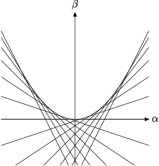
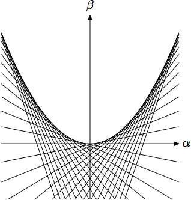

課題1 (2014/5/19)
=========

論文
* 尾山大輔・安田洋祐「経済学で出る包絡線定理」『経済セミナー』2011年10・11月号

を読んで「包絡線定理」の図を書いてみる．

* Matplotlib を使う．
  ゼミの wiki の [Matplotlib のページ](http://oyamazemi.wiki.fc2.com/wiki/Matplotlib)参照．
* なるべく汎用性をもたせる．
  (使い回したいときの改変部を一カ所にまとめる．)
* 適宜コメントを書く．
  (行頭に "#" を入れる．)
* 提出方法：GitHub にリポジトリを「プッシュ」する．
* 締め切り：5月31日 (土)

こんな感じで：




(これらは，むかし [MetaPost](http://oku.edu.mie-u.ac.jp/~okumura/texwiki/?MetaPost)
という言語を使って描いたものです．)

これができたら，次は短期費用曲線群を描いてみる
(新しいファイルを作った方がよいでしょう)．
関数形は，それっぽくなるようなものを自分で探して設定する．

## GitHub

* [github.com](https://github.com) で新しい「レポジトリ」を作る (初回のみ)．
* SourceTree で，大学あるいは自分のコンピュータにレポジトリの「クローン」を作る (作業に使うコンピュータそれぞれで1回ずつ)．
* 大学あるいは自分のコンピュータの「クローン」のフォルダでプログラムのファイルを編集する．
* 一段落したら，SourceTree で「コミット」して「プッシュ」する．
  github.com のレポジトリに反映される．
* (2つ以上の環境で作業するならば) 作業を再開するときに SourceTree で「プル」する．

## 方針

quant-econ の
[subplots.py](https://github.com/OyamaZemi2014/quant-econ/blob/master/programs/subplots.py)
を出発点にしてみましょう．

### 関数の定義
このままだと sin 曲線が描かれるので，描きたい関数を定義しないといけない．  
たとえば，(論文と notation が異なるが) 変数を x，パラメタを t として，
```python
def f(x, t):
    return t * x - t**2
```
と最初の方に書いておき，21行目の `y = np.sin(x)` を
```python
y = f(x, t=1)
```
に変えてみる．  
すると，傾き 1 の直線が1本表示されるはず．

### ループ
このままだと，t=1 と決め打ちなのでとうぜん1本の直線が引かれるだけである．  
t の値を変えつつ plot していきたいので，t についての `for` ループに入れる．  
グラフを何本も描くのは，たとえば An Introductory Example の
[Exercise 6](http://quant-econ.net/python_by_example.html#exercise-6) でやった．  
[Matplotlib のレクチャー](http://quant-econ.net/matplotlib.html)の3本の正規分布の曲線の例も参照のこと．

* ちなみに，論文の図では，
  * 横軸座標の範囲は -5 から 5
  * パラメタの値 (傾き) は，左の図では -2 から 2 まで 1/3 刻み，右の図では
    -3 から 3 まで 1/5 刻み

  にしました．
  もちろん，この通りにする必要はまったくない．
* t について `range()` でループを回すと，`range()`
  の増分は整数値と決まっているので，このままでは非整数値刻みにできない．
  もし非整数値刻みにしたければどうすればよいか．

  → たとえば，単位 u を決めて t=n*u として n を `range()` で回す．

  ほかのやり方もある：  
  [Python decimal range() step value](http://stackoverflow.com/questions/477486/python-decimal-range-step-value)

### 体裁
* グリッドはいらない．
  15行目の `ax.grid()` というのがそれっぽいので，それを消してみよう．
* 22行目の `ax.plot` の x, y 以外の引数を適宜いじる．
  * `'r-'` だと赤くなるので，`'b-'` (黒) にする．
  * label もいらない．
    消すなら `ax.legend(...)` と合わせて消す．
* 目盛りもいらないので消したい．
  「目盛り」は英語で ticks．
  ticks matplotlib で検索してみよう．
* その他，こうしたい，と思ったら [Matplotlib gallery](http://matplotlib.org/gallery.html) でそれらしいものを探すなり Google で検索するなりする．

## その他
* 一息ついたら SourceTree で「コミット」して「プッシュ」．
* 違うコンピュータで作業を再開するときは最初に「プル」するのを忘れないように．
* いまのバージョンに戻る可能性を残しつつ，いろいろ変えて実験してみたい，というときは，SourceTree で新しい「ブランチ」を作成するとよい．
  詳しくは Google で調べて．
